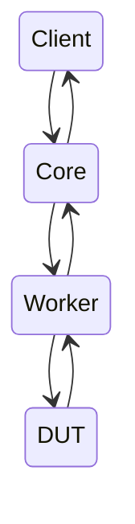

# Leviathan high level architecture

Leviathan consists of 3 containers, `Client`, `Core`, and `Worker`

## Client

The `Client` performs the following functions:

- acts as the front end - users use the client to trigger test jobs
- finds a worker with the matching DUT type in a balena fleet of workers
- sends tests and test artifacts to the `Core` via a websocket connection
- collects and reports logs from the `Core`
- it is configured using a `config.js`, [instructions here](config-reference.md)

## Core

The `Core` container is the container that runs the tests that are sent to it by the `Client` container.

- awaits tests and artifacts from client
- contains helper functions to be used in the tests. Notably this includes bindings to interact with the `Worker` and SSH helpers to interact with the DUT
- tests must be in a specific format to be executed by the core. See the [e2e suite](../suites/e2e/) and the [guide to writing tests](./writing-tests.md)
- checks that a test should be executed before running it, by checking its contract against the [device type contract](https://github.com/balena-io/contracts/tree/master/contracts/hw.device-type)

## Worker

The `Worker` is the container that provides a common interface to the DUT's "physical" interfaces. 

- It has a HTTP webserver interface
- Contains endpoints to power on/off the DUT, flash the DUT, set up the networking environment, capture video output
- Can be used to interface to a physical DUT via a `testbot` or `autokit`, or a virtualised DUT via `qemu`, using the same interface
- The worker can be found in its own [github repo](https://github.com/balena-os/leviathan-worker) 

### Testbot/Autokit workers / Physical DUT

When being used to interface with a physical DUT, the worker container will be on a testbot or autokit balena device, in a balena fleet.

#### Communication 

- The `Core` and `Client` containers always are on a local or cloud host (i.e laptop, jenkins servers), while the `Worker` container is on a balena device
- The core container accesses the worker container http api via the balena devices public url, as it and the `Worker` are on different hosts
- The worker creates a network AP for the DUT to connect to, and provides its internet access. However this results in the DUT and the `Core`, which is running the tests, being on different networks
- The core container, running the tests, can access the DUT via SSH. 
  - Due to the `Core` and DUT being on different networks, this requires the `Core` to use the `Worker` as a jumping point
  - To set up a tunnel to the DUT, via the `Worker`, the `Core` will SSH into the `Worker` via the balena cloud proxy
  - It will then SSH from the worker into the DUT, and set up port forwarding to forward port `22222` of the DUT (the ssh port on a balena device), to an unused port on the worker
  - The `Core` will then set up port forwarding of the `Worker` port that port `22222` of the DUT was mapped to, to port `22222` of the `Core` (itself)
  - This allows the `Core` to SSH into the DUT via this tunnel, at `localhost:22222`
  - As we are using balena cloud proxy and therefor can't forward the ssh agent of the `Core`, SSH keys required to access the DUT must also be sent from the `Core` to the `Worker`.
  - In summary - a tunnel is set up between `Core` and the DUT via the `Worker`

### Qemu workers / virtual DUT

When being used with a virtual DUT, the `Worker` container will be created on the same host as the `Client` and `Core`, and all be connected to the same docker bridge network.

The `Worker` container contains all QEMU dependencies, and will create a QEMU based DUT on demand.

#### Communication

- The worker container creates a bridge interface within it for the QEMU device to use
- iptables rules a DHCP server are set up
- an ip route is created in `Core` to access the DUT ip address, via the `Worker` ip address (on the docker bridge network that `Core` and `Worker` share). The default docker bridge address range is used for this bridge currently.
- The `Core` can thus directly SSH into the `DUT`, using the `DUT` ip address. No tunnelling is required, no SSH keys must be sent to the worker